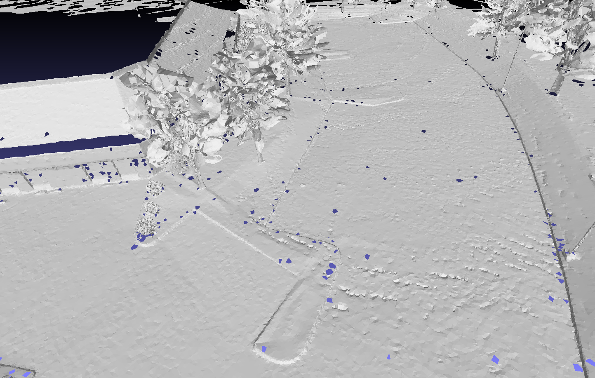

# RGMesh: TriMesh Reconstruction via Riemann Graph with Delaunay neighborhood

This Demo is mainly inspired by "**In the absence of a mesh, we approximate
this neighborhood by building a local mesh**" from _Kris Demarsin_.

[Detection of closed sharp edges in point clouds using normal estimation and
graph theory](http://citeseerx.ist.psu.edu/viewdoc/download?doi=10.1.1.360.4308&rep=rep1&type=pdf)

--- 
